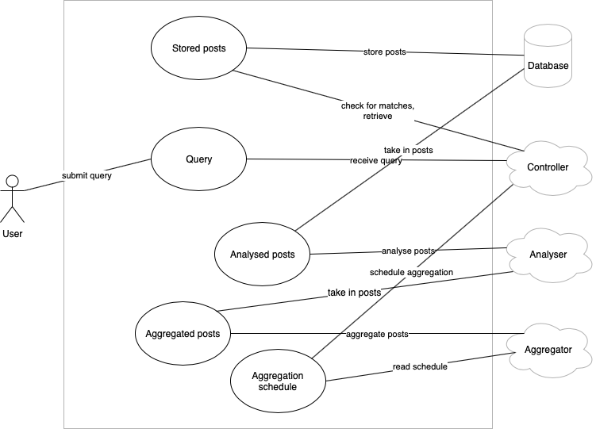
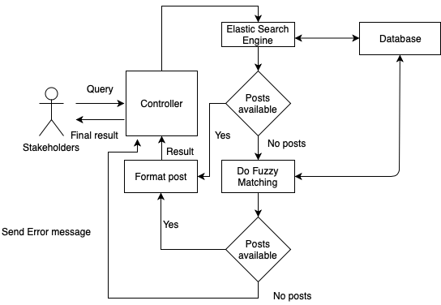

# Requirements

## System Stakeholders

### Internal Stakeholders
1.  **Client**: The software company Ghyston, represented by Mr Richard Meal.
1. **Software Development Team**: The team will be managing, testing, updating and developing this Open source software for our client. Team members:
  * Ben Price (Team Leader)
  * Navya Zaveri
  * Tharidu Jayaratne
  * Martin Noruisis
1. **Supporting Team**
  * **Resource Managers** at the University of Bristol. They will be providing us with funding and resources if necessary.
  * **Our Mentor** Nuha Tumia, a third-year student. She will be helping us with any technical difficulties, throughout the development stage.
  * **Development Managers** Dr Daniel Schien and Dr Simon Lock. They will be supervising and teaching us the fundamentals of software development throughout the stages of development and testing.

### External Stakeholders
1. **Developers**: The developers of the open source software that we will be generating sentiment scores for.
1. **End users**: The people who will be using our software, once it has been fully developed.
  * **Consultants**: People who would use our software to provide expert advice professionally for advertising.
  * **Non-profit groups**: Organisations that could use our software to promote a particular social cause or promoting for a shared point of view, where no part of the organisation's income is distributed to its members, directors, or officers.
  * **The general public**: People who may be interested in finding the sentiment of a post.

-------

## Use case diagram

## Use case goals
We have identified two examples of use case goals.

### "User – submit query and receive result" flow
1. Submit query
1. Run query through the Elasticsearch engine
1. Match the query to posts in database
1. Display the result to the user in the right format

### "ML module: scrape for posts and populate the database" flow
1. Run instances of the different scrapers
1. Determine the sentiment values of the scraped posts
1. Push resulting objects to the Elasticsearch database

### Alternative flow for "User: submit query and receive result"
1. Submit query
1. Run query through the Elasticsearch engine
1. No matches, perform fuzzy matching
1. Posts found, display the result to the user in the right format

### Exceptional flow for "User: submit query and receive result"
1. Submit query
1. Run query through the Elasticsearch engine
1. No matches, perform fuzzy matching
1. No matches
1. Display an error to the user
---

## Functional Requirements

1. The software will be able to extract insights from social media posts related to technology.
1. It must display an overall rating of a query given by the user.
1. It must display a list of up to 10 related posts for every successful query. If there are fewer than 10 posts, the front end will display all posts related to its respected query.
1. When a malformed query is provided *fuzzy matching* will take place.
  * The algorithm will find correspondences between segments of a text and entries in our database of previous translations.
1. Our REST API shall be *idempotent*.
  * Our algorithm can be applied multiple times without affecting the result beyond initial application.
1. The database will be updated at least once a week.
1. The development team will be responsible for maintaining and updating the system, with new posts.
1. The application uses the Elastic search engine to retrieve the closest match to a given query.

## Non-functional Requirements
### Performance
* The software shall be able to handle up to 36 requests per second
  * Rough estimate of requests per second (at peak times)
    * 4.7 million developers in Europe
    * Each making 20 requests
    * Let us assume they all access our website in the same 2 hour period
    * [(4.7M * 20 requests) / 365 days] / 2hr / 60min / 60sec = 36 requests per second

### Legislative
* The software shall be released under the MIT licence.

### Usability
* We will be aiming to make our software as usable as possible by testing on its:
  * **Success rate**: The accuracy of the algorithm will be tested using our questionnaire.
  * **Efficiency**: This will be tested through the unit and system integration tests, to ensure our product delivers the result as fast as possible.
  * **Memorability**: When a user returns to the application after a period of not using it, the user shall remember enough to use it effectively the next time.
  * **User Interface**
      * We aim to make our user interface as user-friendly as possible by:
        * Keeping a minimalistic look so that everything will have a clear meaning.
        * Having an instantly noticeable search bar with a *Call-To-Action* search button.

  *We will be testing Usability by showing our product to a small sample of users and observing how they interact with it. Users will be asked for feedback via a questionnaire. Users will rate the usability on a scale 1-10. The average score shall be >7.*

#### User Interface Mock-ups

### Ethical
* To ensure that we are not biased against or towards particular pieces of software, we have to make sure that we are scraping posts expressing both negative and positive opinions for all queries.
